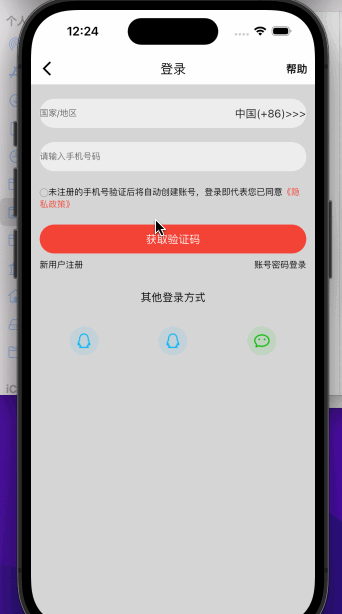
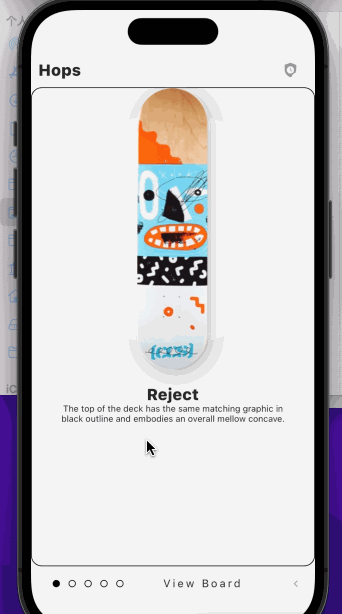
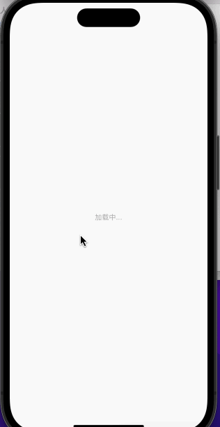
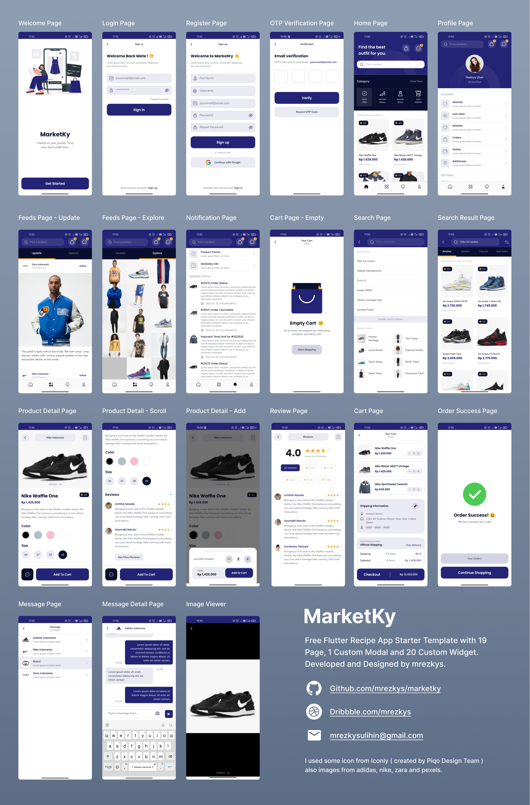

# Flutter UI Screenshots

- flutter_chatgpt_app

- flutter_valorant_app

  
  
  
  
  
  
  
  
  
  

- flutter_compass_app

  

- flutter_fitness_app

  

- flutter_weather

  
  
  
  
  
  
  
  

- flutter_jd

  
  
  
  
  
  
  
  
  
  

- flutter_oorbswallpaper_app

  

- flutter_black_hole

- flutter_foodhub_app

  
  

- flutter_crypto_market_app

  

- flutter_nimbus_app

  
  
  

- flutter_paytabs_tickets_app

  
  

- flutter_muet_attendance_taking_app

  

- flutter_periodic_table_app

  
  
  
  

- flutter_marketky_app

  

- flutter_quiz_app

  

- flutter_to_do_app

  
  
  
  

- flutter_chat_app

  

- flutter_books
