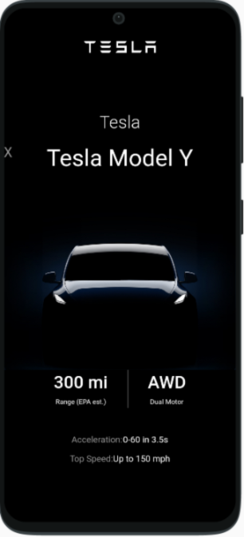
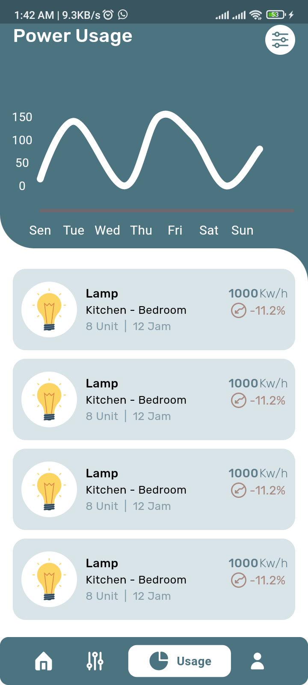
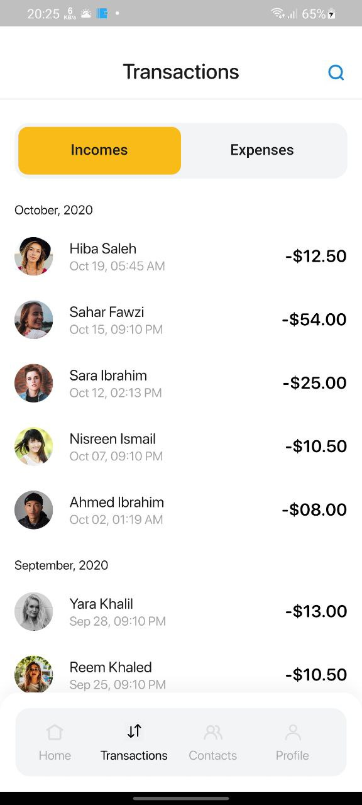
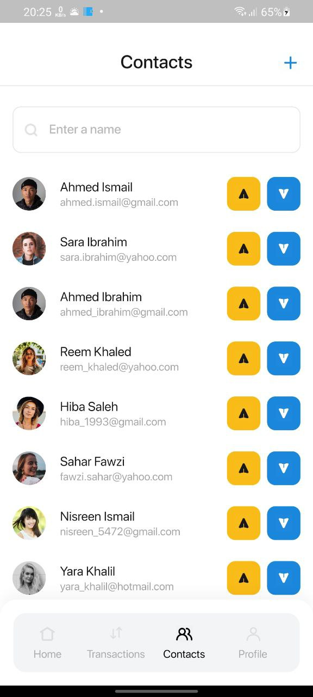
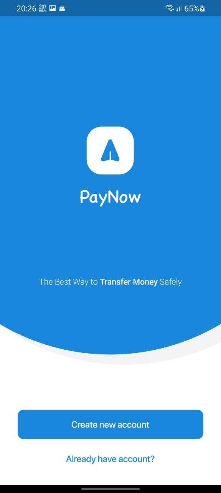
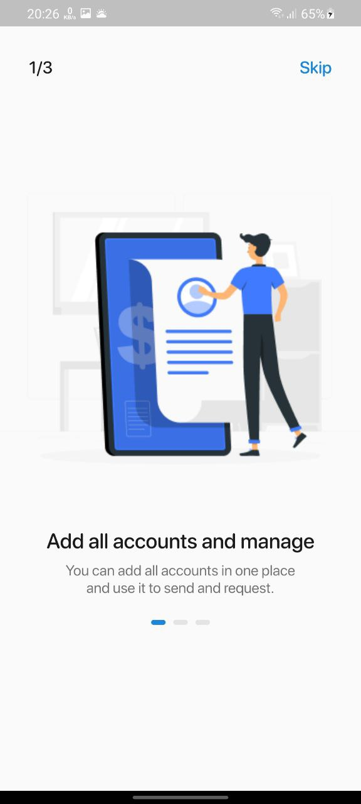
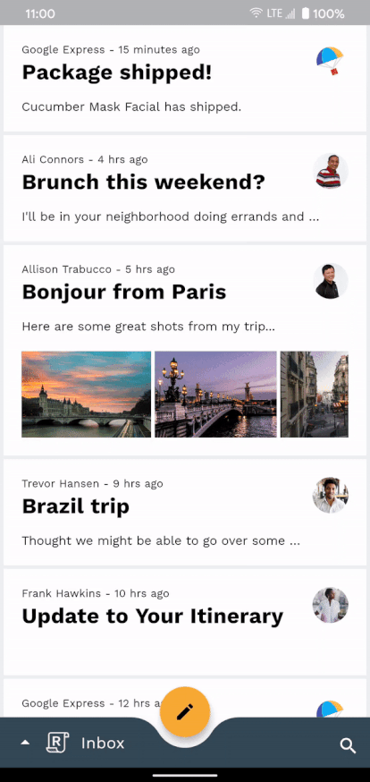

# Flutter UI Screenshots

- ui_goplan_app

  

- ui_parallax_effect_app

  

- ui_smart_home_animated_app

  

- ui_shoe_app

  

- ui_ecommerce_mobile_app

- ui_tesla_app

  
  
  
  
  
  
  
  

- ui_chat_message_app

  

- ui_smart_home_app

  
  
  
  
  
  

- ui_fd_project_management_app

  
  
  
  

- ui_pay_now_ewallet_app

  
  
  
  
  
  
  
  
  
  
  
  
  
  
  
  
  
  
  
  
  
  

- ui_responsive_app

  

- ui_animated_travel_app

  

- ui_blogclub_app

  
  
  
  
  
  
  
  

- ui_ecommerce_complate_app

  

- ui_motion_animations_reply_app

  
  
  
  
  
  
  
  
  
  

- ui_coffe_app

  

- ui_ticket_booking_app

  

- ui_instagram_app

  

- ui_food_app

  

- ui_animated_rive_app

  

- ui_task_management_app

  

- ui_fd_daily_task_app

- ui_online_shopping_app

  

- ui_clock_app

  

- ui_facebook_app

  

- ui_foodybite_app

  
  
  
  
  
  
  
  

